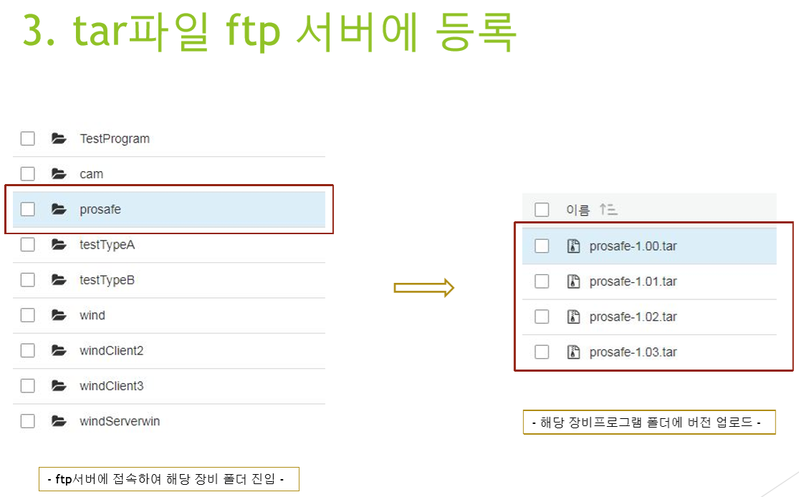

# 통합 관리 프로그램
## 프로젝트 소개
- 현장에서 사용되는 모든 장비 프로그램의 버전 업데이트 및 config 정보 수정, 프로그램 교체 용도로 쓰기 위해 제작되었습니다. 장비를 직접 회수하여 업데이트하고 교체하는 작업이 번거롭게 느껴져 관리프로그램을 하나 만들어 모든 장비 프로그램을 관리할 수 있도록 구현되어있으며, 모든 기능의 구현을 담당하였습니다.
- Manager 프로그램과 Agent 프로그램으로 나뉘며, Manager 프로그램은 Winform으로 제작되어 PC에서 사용되고, Agent프로그램은 라즈베리파이 환경에서 백그라운드로 실행되어 장비프로그램을 실행시켜주고, TPC 통신을 하며 Manager프로그램의 명령을 따르도록 구현되었습니다. 
- 사전준비로는 라즈베리파이 환경에서 다운을 받아야 하기 때문에 업데이트에 사용할 장비프로그램을 .tar 파일로 압축하여 ftp 서버에 올려줍니다. Manager 프로그램은 올려진 장비프로그램의 이름과 버전정보를 바탕으로 업데이트나 프로그램 교체 등을 실행합니다.
- Agent 프로그램은 장비 프로그램이 실행중인지 실시간으로 확인하는 역할도 하며, 장비 프로그램이 예기치 못하게 꺼진경우 다시 부팅시켜주는 역할도 합니다. 장비 프로그램이 정상 실행되었을 때 Manager 프로그램에 등록되어 있지 않다면 자신을 등록시키도록 합니다.  
</img>
</img>
</img>
</img>
</img>
</img>
</img>
</img>
</img>
</img>
</img>
